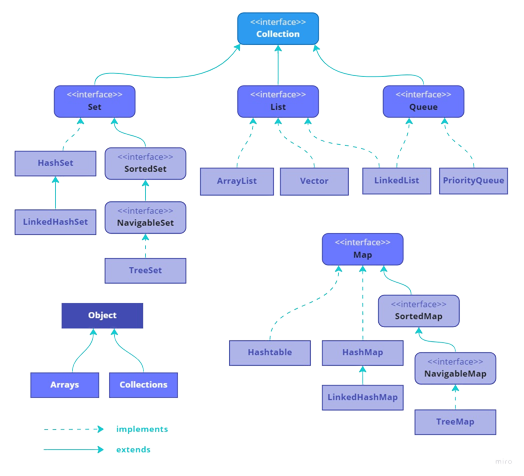

<h1>Collections</h1>

Collections Framework é um conjunto bem definido de interfaces e classes para 
representar e tratar grupos de dados como uma única unidade, que pode ser chamada 
coleção, ou collection.

<h2>Interfaces</h2>

Interfaces são tipos abstratos que representam as coleções. Permitem que coleções 
sejam manipuladas tendo como base o conceito “Programar para interfaces e não para 
implementações”, desde que o acesso aos objetos se restrinja apenas ao uso de métodos
definidos nas interfaces.

<h3>Set</h3> 

Interface que define uma coleção que não permite elementos duplicados.

<h3>List</h3>

Define uma coleção ordenada, podendo conter elementos duplicados. 
Em geral, o usuário tem controle total sobre a posição onde cada elemento 
é inserido e pode recuperá-los através de seus índices. Prefira esta interface 
quando precisar de acesso aleatório, através do índice do elemento.

<h3>Queue</h3> 

Um tipo de coleção para manter uma lista de prioridades, onde a ordem dos seus 
elementos, definida pela implementação de Comparable ou Comparator, determina essa 
prioridade. Com a interface fila pode-se criar filas e pilhas.

<h3>Map</h3> 

Mapeia chaves para valores. Cada elemento tem na verdade dois objetos: uma
chave e um valor.
